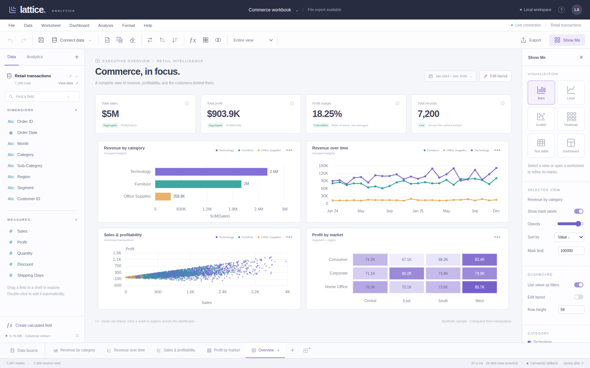

# Lattice Analytics

An independent, local-first visual analytics application built with **plain HTML, CSS, and JavaScript**. Author worksheets with drag-and-drop shelves, compute real queries in a worker, and compose linked, editable dashboards. Chart marks use an instanced WebGPU renderer when available and an explicitly identified Canvas2D fallback otherwise.

The application includes runnable source, a self-contained HTML build, deterministic synthetic data, and automated engine, model, and browser tests. It has no framework, runtime packages, CDN assets, API keys, or remote analytics service.



## GitHub Pages

Live application: **https://wieslawsoltes.github.io/LatticeAnalytics/**

The Pages workflow runs the engine/model tests, produces a self-contained site, and deploys changes pushed to `main`. `npm run build:pages` reproduces the deployment in `_site/`; `npm run sample` regenerates the portable Commerce workbook from its deterministic transactions. No runtime dependencies or secrets are required.

## Run

Use Node.js 20 or later:

```sh
cd lattice-analytics
npm start
```

Open **http://127.0.0.1:4173**. There is no `npm install` step. `HOST` and `PORT` environment variables configure the small development server; it binds to loopback by default. Serve only trusted files from this development server.

```sh
npm test        # Node built-in test runner; no test dependencies
npm run build   # Rebuild dist/lattice.html from the modular source
```

`dist/lattice.html` is a complete single-file build, including styles, application code, the synthetic-data generator, and a Blob worker. It can be copied independently. Serving it through localhost or HTTPS is recommended: browser support, security context, and storage permissions determine WebGPU and IndexedDB availability. Direct `file:` opening is not a guaranteed cross-browser deployment mode. If browser storage is blocked, use **File → Download workbook** to keep changes.

## First workflow

The initial **Commerce workbook** contains 7,200 synthetic transactions, four real worksheets, and a linked dashboard. Sales, profit, order counts, trends, and heatmap values are calculated from the transactions; the visualization does not contain precomputed demo answers. A separate small Regional targets source supports join demonstrations.

Open **Revenue by category** along the bottom. Drag a dimension to **Rows** and a measure to **Columns**, or double-click a field to place it automatically. The pill menu changes SUM to AVG, MIN, MAX, COUNT, COUNTD, or sample standard deviation. Additional numeric shelf pills create additional chart series. The Marks card accepts Color, Size, Label, and Detail. Choose another chart type in **Show Me**.

Drag a field to **Filters** for a member-selection, numeric-range, or date-range filter. Click a mark in a dashboard to filter the other views on that source. Ctrl/Command-click extends selection; Shift-drag brushes a scatter plot; Escape clears selection. **Edit layout** enables moving, resizing, adding, and removing dashboard tiles on a 12-column grid.

**Connect data** imports CSV or JSON. Source previews show typed fields and paginated records. The included `examples/orders.csv` and `examples/regions.json` can be imported and joined on Region using **Data → Join data sources**. Inner, left outer, and full outer joins support composite keys and duplicate matches.

Create a calculated field with the **fx** control. For example:

```text
IF [Sales] > 0 THEN [Profit] / [Sales] ELSE NULL END
```

```text
DATETRUNC('month', [Order Date])
```

```text
IF [Sales] >= 1000 THEN 'Large order' ELSE 'Regular order' END
```

Calculations operate per source row and have a statically checked result type. Apply aggregations with shelf pills. The dashboard margin KPI intentionally uses **SUM(Profit) / SUM(Sales)**, not AVG of per-row ratios.

**File → Download workbook** exports a portable `.lattice` JSON file containing workbook metadata, source records, schemas, and derived-field definitions. Reopening it reconstructs the actual sources and queries. Local autosave uses IndexedDB when available. Export controls also produce source CSV/JSON, query-result CSV/JSON, and vector chart SVG.

## Implemented surface

| Area | Working implementation |
| --- | --- |
| Data | CSV/JSON import and append, schema inference, nulls, paginated preview, dimensions/measures, dictionary-encoded strings, typed columns |
| Queries | Explicit inspectable plan, row predicates, tuple filters, grouped and raw projections, seven aggregate operations, stable sort, result limits, append-delta aggregation, cache diagnostics |
| Authoring | Multiple worksheets, shelves, Marks channels, aggregation menus, calculated fields, reusable groups, materialized joins |
| Charts | Bar, line, scatter, heatmap, text table, tooltips, continuous and categorical colors, mark selection, scatter brush, vector SVG |
| Dashboards | Multiple dashboards, 12-column snapped tile layout, move/resize, add/remove, linked selections, editable headings, calculated KPI cards |
| Persistence | Versioned portable workbook format, IndexedDB autosave, metadata undo/redo, derived-field reconciliation, actual source-data undo for append |
| Rendering | Instanced WebGPU primitives, shared pipeline/device, batched buffer uploads, dirty-only rendering, resource cleanup, spatial-grid picking, Canvas2D fallback |

## Source layout

```text
index.html                 Semantic application shell
styles.css                 Original desktop authoring UI
src/expression.js          Lexer, typed parser, bytecode compiler and interpreter
src/core.js                Columnar storage, imports, joins, query plan and aggregates
src/worker.js              Isolated data engine and RPC entry point
src/model.js               Workbook/history and shelves → query → chart models
src/renderer.js            Chart geometry, WebGPU/Canvas2D, spatial picking, SVG
src/app.js                 UI interactions, orchestration, persistence, exports
tools/serve.mjs            Dependency-free development server
tools/build.mjs            Dependency-free single-file packager
dist/lattice.html          Ready-to-run embedded build
examples/                  CSV/JSON inputs and a portable sample workbook
tests/                     Engine, model, UI and dense-data checks
test-results/              Executed-test reports and screenshots
```

See **[ARCHITECTURE.md](ARCHITECTURE.md)** for contracts, algorithms, memory behavior, query examples, and extension points. See **[TESTING.md](TESTING.md)** for exactly what was and was not executed.

## Deliberate boundaries

This is an original working implementation, not a binary-compatible or feature-complete replacement for Tableau Desktop. It does not import `.twb`/`.twbx`, implement Tableau Server, connect to database servers, or provide authentication/collaboration. Calculations use the documented Lattice row-expression dialect rather than Tableau's complete LOD/table-calculation language. There are no maps, extracts in Tableau's format, pivot engine, or statistical-modeling suite.

Joins are materialized snapshots and must be rerun to incorporate later changes in their inputs. Linked dashboard filtering follows the same source identity, not arbitrary cross-source relationships. Query processing runs on the CPU in a worker; WebGPU accelerates rendering, not joins or aggregation. All data fits in browser memory: this is not an out-of-core engine. The implementation limits sources to 2,000,000 rows and 512 fields, but those are guardrails, not verified capacity or latency guarantees. Individual visualizations have configurable result limits, initially 100,000 marks.

The shipped tests executed real worker operations, browser interactions, portable workbook round-trips, and Canvas2D rendering, including 100,000 scatter marks. **The WebGPU runtime path and IndexedDB reload behavior were not verified in the available browser environment.** Their implementations are included; they require verification in the target browser/device before deployment. No hardware WebGPU throughput or frame-rate claim is made.

## Privacy and security

Runtime data stays in this application and its worker; no application telemetry or external data requests are implemented. Browser-local storage is not encryption or an access-control boundary. Imported values are escaped for DOM/SVG output, calculations never use `eval`, and workbook restore uses a staging engine before committing. Treat files as untrusted: very large or adversarial input can still exhaust memory. CSV export preserves original values; cells beginning with spreadsheet formula prefixes may be interpreted as formulas when opened in other programs. Review/sanitize untrusted exports before doing so.

## References

The familiar Data pane / shelves / Marks / Show Me workflow is informed by Tableau's published workspace and shelves documentation. All source, branding, icons, and styling here are independently implemented; no Tableau assets or code are used.

- Tableau Workspace: https://help.tableau.com/current/pro/desktop/en-us/environment_workspace.htm
- Shelves and Cards Reference: https://help.tableau.com/current/pro/desktop/en-us/buildmanual_shelves.htm
- Filter Actions: https://help.tableau.com/current/pro/desktop/en-us/actions_filter.htm
- W3C WebGPU specification: https://www.w3.org/TR/webgpu/

MIT licensed; see `LICENSE`.
